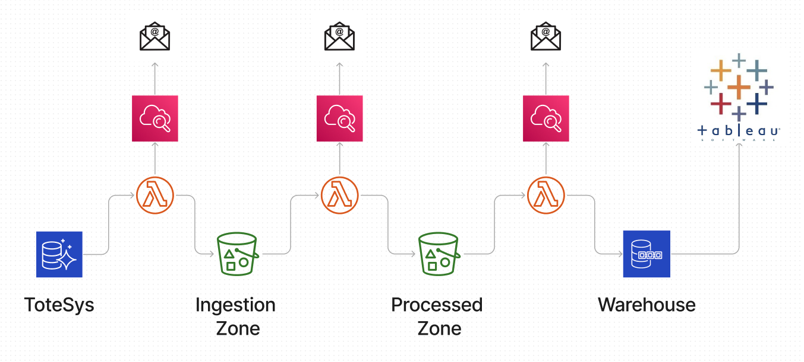
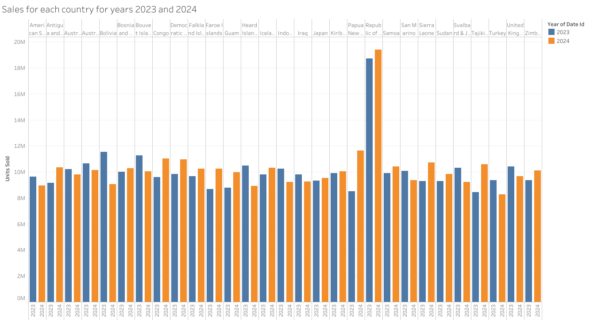
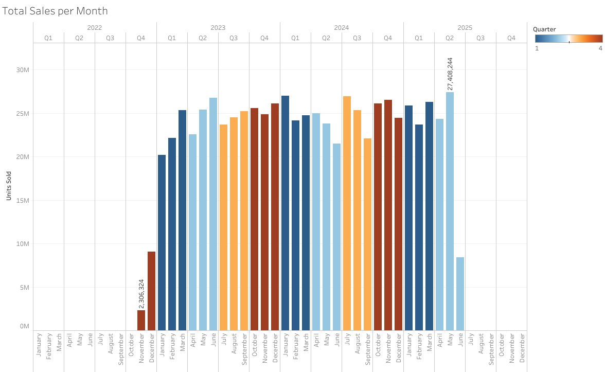

# Data Engineering Project - Funland Team

This repository contains the final team project of the North Coders Data Engineering Bootcamp, showcasing a full-stack ETL (Extract, Transform, Load) pipeline designed for real-world data engineering practice.

- Data ingestion from PostgreSQL into AWS S3 data lakes.

- Transformation into star-schema format using pandas and awswrangler.

- Deployment managed with Infrastructure-as-Code (Terraform).

- Automated testing and deployment with CI/CD pipelines via GitHub Actions and Makefile.

- Monitoring, logging, and alerts integrated via AWS CloudWatch and SNS.

- Business dashboards and insights delivered through Tableau.

## Tech Stack - Hari

**Python:**\
awswrangler 3.12.0 \
boto3 1.38.24 \
pandas 2.3.0 \
pg8000 1.31.2 \
pytest 8.3.5 \
urllib3 2.4.0

**Terraform**\
**Git**


## Installation 

Create a virtual environment 

```python 
python -m venv venv 
```
Activate your venv

```python 
source venv/bin/activate
```
**Install packages** <br><br>
Required packages are listed in our requirements.txt and can be installed using our makefile. 

```bash
make -f makefile
``` 

**Terraform** 

Initialise Terraform 

```bash
cd terraform
terraform init 
```
Backend has been set up to store the statefile separately. This can be reviewed in terraform/main.tf

Terraform can be run using the following commands: 
```bash 
terraform plan 
terraform apply
```

    
## Usage/Examples  - Shayan

Firstly, activate your virtual environment

```bash
source venv/bin/activate
```

To use AWS services and infrastructure, sign up to a AWS account and create a IAM user. Once this is done, extract your AWS_ACCESS_KEY_ID and AWS_SECRET_ACCESS_KEY.

```bash
export AWS_ACCESS_KEY_ID=<your key id>
export AWS_SECRET_ACCESS_KEY=<your secret access key>
export AWS_DEFAULT_REGION=<your default region>
```

An aws parameter needs to be put into parameter store with a parameter name of "last_checked". This parameter is a date in the format "YYYY-MM-DD HH:MM:SS:ffffff". This date should be some date before 2019, to ensure that all the data gets extracted from the database initially.


Now your aws account is linked to your local terminal and you are ready to navigate to the terraform directory

```bash
cd terraform
```

In this directory, an initialisation is needed to download the required hashicorp version and to setup the location of the terraform state file remotely. To accomplish this, we run:

```bash
terraform init
```

Once this finished, we are ready to see a plan of the infrastructure and its availability:

```bash
terraform plan
```

Be sure that all the information looks correct, and we are ready to deploy!! Run:

```bash
terraform apply
```

All the infrastructure should be created (ingestion and processed buckets, ETL lambdas and a step function to facilitate them, alongside the necessary roles and cloudwatch logs and notification systems):

```console

Apply complete! Resources: 1 added, 0 changed, 1 destroyed.

Outputs:

notification_email = "<email to receive error notifications>"

```


To see the infrastructure, we can use AWS CLI to view our buckets:

```bash
aws s3 ls
```


example output:

```console
2025-05-28 10:24:59 <ingestion-bucket-name>
2025-05-28 10:24:59 <processed-bucket-name>
```

And checking the AWS console for our state machine we can see:


## Running Tests - Elisa


To run tests, run the following command:

```bash
   make unit-test
```
To run all checks (tests, linting, security and coverage), run the following command:

```bash
   make run-checks
```


## Visuals - Hari








## Acknowledgements

We would like to acknowledge **[Northcoders](https://www.northcoders.com/)** for providing the **Data Engineering Bootcamp**, which was instrumental in building the foundations for this project.  


We also used the following resources and tools throughout the project:
- [Pandas](https://pandas.pydata.org/docs/index.html) - For data sanitising.
- [Boto3](https://boto3.amazonaws.com/v1/documentation/api/latest/index.html) - The Amazon Web Services (AWS) SDK for Python, used extensively for interacting with AWS services.
- [Terraform Official Documentation](https://developer.hashicorp.com/terraform/docs) - Comprehensive and clear documentation that helped in managing infrastructure as code.
- [AWS Wrangler](https://aws-data-wrangler.readthedocs.io/en/stable/) - A Python library that made working with AWS data services much easier.


## Authors

- [@Leda909](https://github.com/Leda909)
- [@lisa624](https://github.com/lisa624)
- [@sapkotahari](https://github.com/sapkotahari)
- [@sarah-larkin] (https://github.com/sarah-larkin)
- [@shayanshater](https://github.com/shayanshater)


