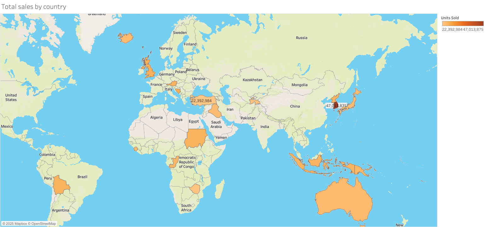
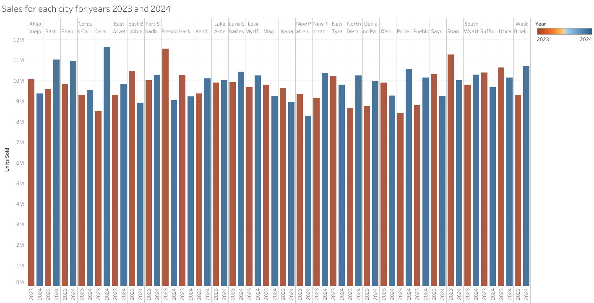

# Data Engineering Project - Funland Team

This repository contains the final team project of the North Coders Data Engineering Bootcamp, showcasing a full-stack ETL (Extract, Transform, Load) pipeline designed for real-world data engineering practice.
Apply Agile development methodology, use project management tools such as Trello and Slack.

- Data ingestion from PostgreSQL into AWS S3 data lakes.

- Transformation into star-schema format using pandas and awswrangler.

- Deployment managed with Infrastructure-as-Code (Terraform).

- Automated testing and deployment with CI/CD pipelines via GitHub Actions and Makefile.

- Monitoring, logging, and alerts integrated via AWS CloudWatch and SNS.

- Business dashboards and insights delivered through Tableau.

## Tech Stack - Hari

**Python:**
awswrangler 3.12.0
boto3 1.38.24
pandas 2.3.0
pg8000 1.31.2
pytest 8.3.
urllib3 2.4.0

**Terraform**
**Git**


## Installation 

Create a virtual environment 

```python 
python -m venv venv 
```
Activate your venv

```python 
source venv/bin/activate
```
**Install packages** <br><br>
Required packages are listed in our requirements.txt and can be installed using our makefile. 

```bash
make -f makefile
``` 

**Terraform** 

Initialise Terraform 

```bash
cd terraform
terraform init 
```
Backend has been set up to store the statefile separately. This can be reviewed in terraform/main.tf

Terraform can be run using the following commands: 
```bash 
terraform plan 
terraform apply
```

    
## Usage/Examples  - Shayan

```javascript
import Component from 'my-project'

function App() {
  return <Component />
}
```


## Running Tests - Elisa

To run tests, run the following command

```bash
  npm run test
```


## Visuals - Hari







## Acknowledgements

We would like to acknowledge **[Northcoders](https://www.northcoders.com/)** for providing the **Data Engineering Bootcamp**, which was instrumental in building the foundations for this project.  


We also used the following resources and tools throughout the project:
- [Pandas](https://pandas.pydata.org/docs/index.html) - For data sanitising.
- [Boto3](https://boto3.amazonaws.com/v1/documentation/api/latest/index.html) - The Amazon Web Services (AWS) SDK for Python, used extensively for interacting with AWS services.
- [Terraform Official Documentation](https://developer.hashicorp.com/terraform/docs) - Comprehensive and clear documentation that helped in managing infrastructure as code.
- [AWS Wrangler](https://aws-data-wrangler.readthedocs.io/en/stable/) - A Python library that made working with AWS data services much easier.


## Authors

- [@Leda909](https://github.com/Leda909)
- [@lisa624](https://github.com/lisa624)
- [@sapkotahari](https://github.com/sapkotahari)
- [@sarah-larkin] (https://github.com/sarah-larkin)
- [@shayanshater](https://github.com/shayanshater)


